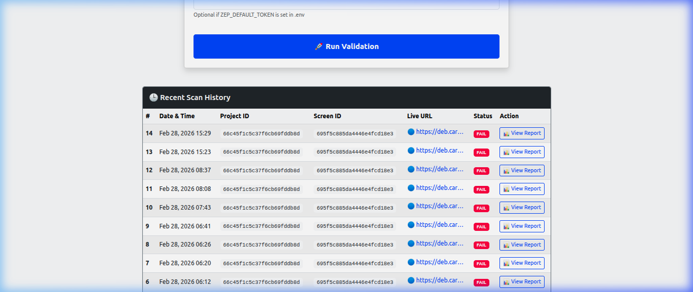
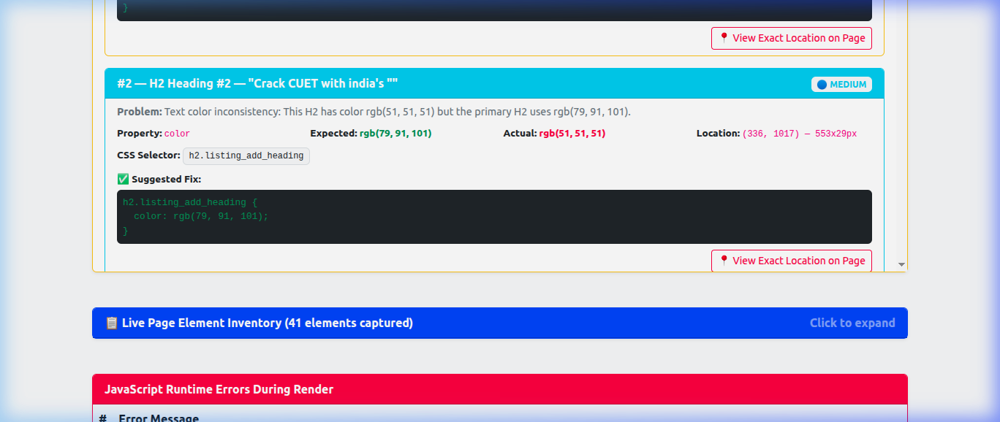
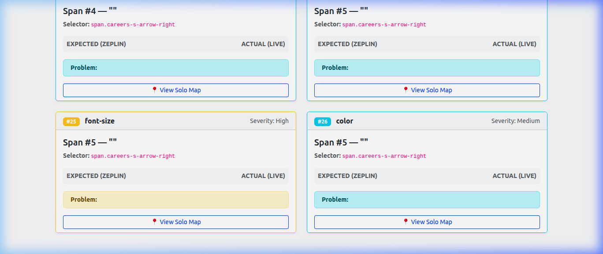
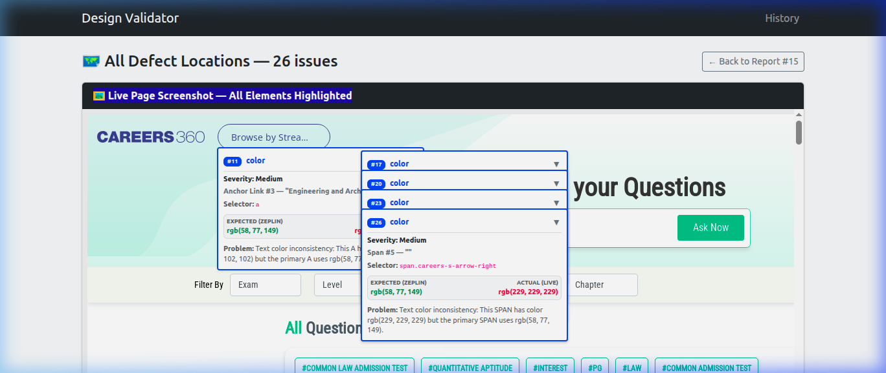

# Zeplin Design Validator

An automated Django 4.2 application to programmatically validate web pages against Zeplin designs using Playwright, Pixelmatch, and Python. For local testing.

## Overview

The validator connects to the Zeplin API, downloads the design and metadata, takes a live screenshot of a local or public URL using Playwright Chromium (with animations disabled), and uses Mapbox's Pixelmatch to calculate image diffs. It also extracts text styles and injects scripts to evaluate computed styles.

## Prerequisites
- Python 3.12 (Compatible)
- Zeplin Personal Access Token
## Visual Previews

### 1. Dashboard & Recent Scans


### 2. Live Geometric Validation Grid


### 3. Deep-Dive CSS Mismatch Details


### 4. Interactive Drag-and-Drop Navigation Map


## Setup Instructions

1. **Activate Environment**
```bash
python3 -m venv venv
source venv/bin/activate
```

2. **Install Dependencies**
```bash
pip install -r requirements.txt
playwright install chromium
```

3. **Configure Environment Variables**
Create a `.env` file in the root `zeplin_test` folder or `design_validator/` app folder with:
```env
SECRET_KEY=your_secret_key_here
DEBUG=True
ZEP_DEFAULT_TOKEN=your_zeplin_personal_access_token_here
```

4. **Run Database Migrations**
```bash
python manage.py migrate
```

5. **Start Local Server**
```bash
python manage.py runserver
```

## Usage
1. Open your browser to `http://127.0.0.1:8000/`.
2. Input your Zeplin token (or rely on the default in `.env`), your Zeplin Project ID, Zeplin Screen ID, and the Live URL of the webpage to test.
3. Click "Run Validation".
4. The system will perform the Playwright traversal, image diff generation, and DOM computed CSS validation.
5. You will be redirected to a beautiful interactive report showing pass/fail status, visual diffs, and CSS mismatches.

## Example Test Data

- **Project ID**: `5xxx` (Find in your Zeplin project URL)
- **Screen ID**: `6xxx` (Find in your Zeplin screen URL)
- **Live URL**: `http://localhost:3000/` or `https://google.com`

## Troubleshooting

- **Playwright errors about missing dependencies (`libX11` etc)**: Ensure you have system dependencies installed. Try `playwright install-deps`.
- **CSS Mismatches always returning not_found**: Ensure the Zeplin design layers have recognizable text matching your live app, or update the text content mapping logic in `css_validation_service.py` based on your DOM structure.
- **Permission Errors**: Verify `media/` folder is writable so screenshots can be temporarily stored and saved to image fields.
